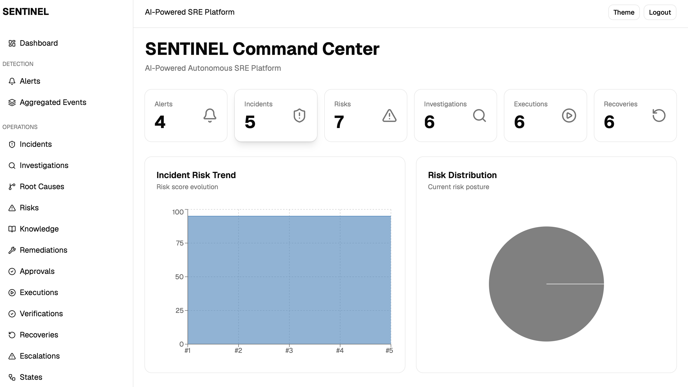

# SENTINEL — Autonomous AI-Powered SRE Platform

<p align="center">
  
</p>

<p align="center">
  <strong>Observe → Investigate → Analyze → Remediate → Verify → Recover</strong>
</p>

<p align="center">
  An AI-powered Autonomous Site Reliability Engineering (SRE) platform that continuously monitors infrastructure, performs root cause analysis, assesses risk, executes remediation workflows, verifies recovery, and learns from historical incidents.
</p>

---

# Overview

SENTINEL is an event-driven, AI-native operational intelligence platform designed to automate the complete incident management lifecycle.

The platform ingests telemetry from cloud-native environments, correlates logs, metrics, traces, Kubernetes events, and deployments, then leverages autonomous AI engines to investigate incidents, identify root causes, assess impact, recommend remediation, execute recovery actions, and generate executive reports.

---

# Architecture

```text
                         ┌─────────────────────┐
                         │ Telemetry Sources   │
                         │                     │
                         │ Prometheus Metrics  │
                         │ Loki Logs           │
                         │ Jaeger Traces       │
                         │ Kubernetes Events   │
                         │ Deployments         │
                         └──────────┬──────────┘
                                    │
                                    ▼
                     ┌────────────────────────────┐
                     │      Ingestion Layer       │
                     └──────────┬─────────────────┘
                                │
                                ▼
                     ┌────────────────────────────┐
                     │     Processing Layer       │
                     │ Normalization              │
                     │ Correlation                │
                     │ Enrichment                 │
                     └──────────┬─────────────────┘
                                │
                                ▼
                     ┌────────────────────────────┐
                     │      Kafka Event Bus       │
                     └──────────┬─────────────────┘
                                │
                                ▼
┌─────────────────────────────────────────────────────────────────────┐
│                         AI Intelligence Layer                       │
├─────────────────────────────────────────────────────────────────────┤
│ Investigation Engine                                                │
│ Root Cause Analysis Engine                                          │
│ Risk Assessment Engine                                              │
│ Remediation Engine                                                  │
│ Approval Engine                                                     │
│ Execution Engine                                                    │
│ Verification Engine                                                 │
│ Recovery Engine                                                     │
│ Escalation Engine                                                   │
│ Knowledge Engine                                                    │
│ Executive Reporting Engine                                          │
└─────────────────────────────────────────────────────────────────────┘
                                │
                                ▼
                     ┌────────────────────────────┐
                     │      Persistence Layer     │
                     └──────────┬─────────────────┘
                                │
                                ▼
                     ┌────────────────────────────┐
                     │       FastAPI Backend      │
                     └──────────┬─────────────────┘
                                │
                                ▼
                     ┌────────────────────────────┐
                     │       React Dashboard      │
                     └────────────────────────────┘
```

---

# Incident Lifecycle

```text
Metrics / Logs / Traces
           │
           ▼
Telemetry Ingestion
           │
           ▼
Normalization & Correlation
           │
           ▼
Incident Detection
           │
           ▼
Investigation Engine
           │
           ▼
Root Cause Analysis
           │
           ▼
Risk Assessment
           │
           ▼
Remediation Planning
           │
           ▼
Approval Workflow
           │
           ▼
Execution Engine
           │
           ▼
Verification Engine
           │
           ▼
Recovery Engine
           │
           ▼
Escalation Engine
           │
           ▼
Executive Reporting
```

---

# Core Features

## Observability

* Prometheus Metrics Collection
* Loki Log Aggregation
* Jaeger Distributed Tracing
* Kubernetes Event Monitoring
* Deployment Tracking

## AI Investigation

* Signal Correlation
* Timeline Construction
* Evidence Extraction
* Confidence Scoring

## Root Cause Analysis

* Causal Chain Detection
* Hypothesis Generation
* Evidence Analysis
* Automated Classification

## Risk Intelligence

* Blast Radius Analysis
* Business Impact Estimation
* Customer Impact Assessment
* MTTR Prediction
* SLO Risk Calculation

## Autonomous Operations

* Intelligent Remediation Planning
* Runbook Selection
* Rollback Recommendation
* Automated Execution
* Post-Execution Verification

## Recovery & Escalation

* Recovery Strategy Planning
* Automated Recovery Workflows
* Human Escalation Framework
* Incident Severity Analysis

## Knowledge Management

* Incident Classification
* Remediation Tracking
* Historical Learning
* Operational Memory

## Executive Reporting

* Executive Summaries
* Business Impact Reports
* Incident Reports
* Operational Insights

---

# Project Structure

```text
SENTINEL
│
├── ingestion/          # Telemetry collection layer
├── processing/         # Event processing pipeline
├── ai/                 # Autonomous intelligence engines
├── backend/            # FastAPI backend
├── sentinel-ui/        # React frontend dashboard
├── infra/              # Infrastructure resources
├── scripts/            # Utility scripts
├── test/               # Test suites
│
└── docs/               # Documentation & images
```

---

# Technology Stack

## Backend

* FastAPI
* SQLAlchemy
* Alembic
* PostgreSQL
* JWT Authentication
* RBAC Authorization

## Event Streaming

* Apache Kafka

## Observability

* Prometheus
* Loki
* Jaeger
* Kubernetes

## AI Layer

* Custom Autonomous Agents
* Investigation Engine
* Root Cause Analysis Engine
* Risk Assessment Engine
* Remediation Engine

## Frontend

* React
* TypeScript
* Vite
* Tailwind CSS
* Shadcn UI
* TanStack Query
* Zustand
* Recharts
* Framer Motion

## Infrastructure

* Docker
* Kubernetes
* Kind
* Helm

---

# Dashboard Capabilities

The dashboard provides:

* Real-Time Incident Monitoring
* Alert Management
* Root Cause Visualization
* Risk Assessment Views
* Investigation Timelines
* Remediation Tracking
* Recovery Monitoring
* Executive Reporting
* User & Role Management
* Operational Analytics

---

# Security

* JWT Authentication
* Role-Based Access Control (RBAC)
* Permission-Based Authorization
* Approval Workflows
* Audit Trails
* Execution Governance

---

# Future Enhancements

* LLM-Powered Incident Summaries
* Multi-Cluster Federation
* Predictive Failure Detection
* Reinforcement Learning Remediation
* ChatOps Integration
* Slack & Microsoft Teams Integration
* OpenTelemetry Native Support

---

# Author

**Saksham Goyal**

AI • SRE • DevOps • Cloud • Platform Engineering

Building intelligent autonomous infrastructure systems.
